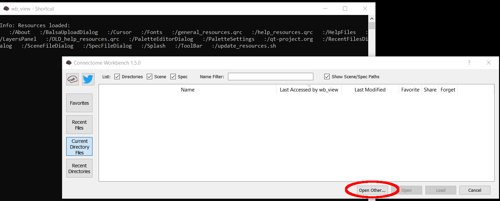
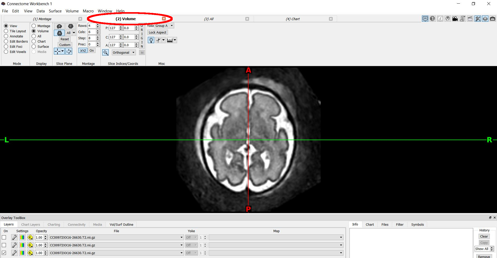
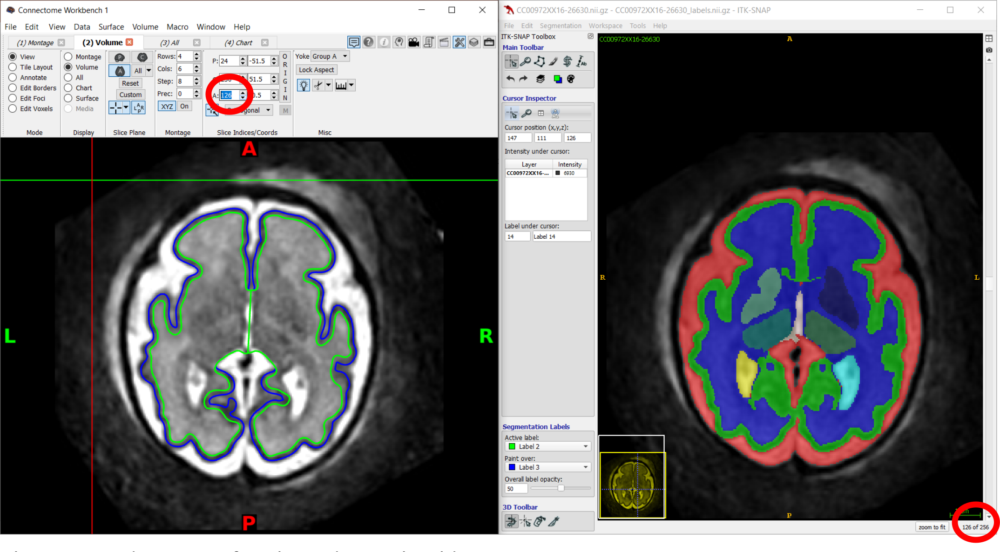
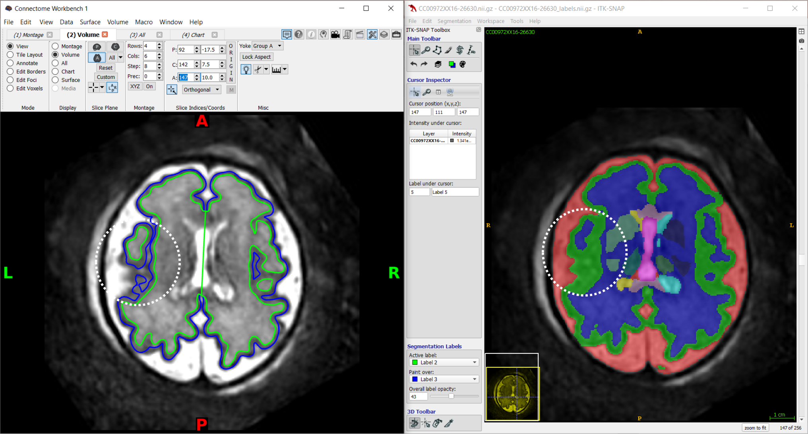
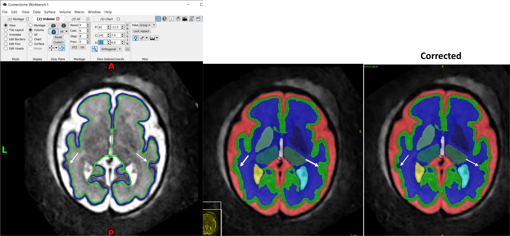
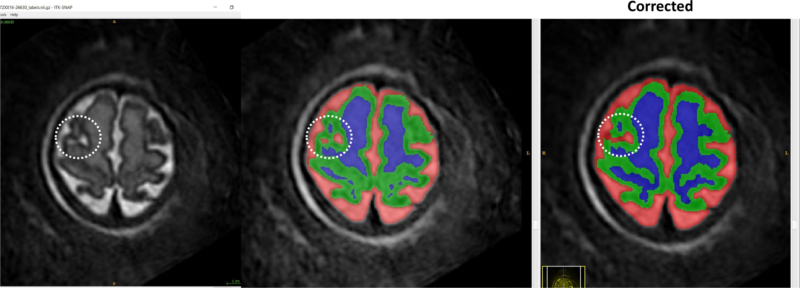
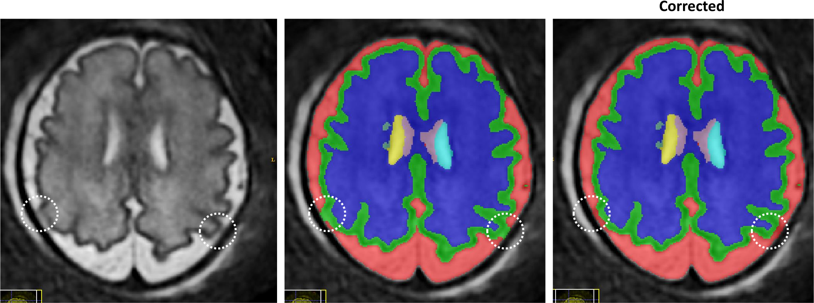

## Guidelines for editing cortical labels for surface generation (DrawEM v1.2)

### Software:
- [Workbench](https://www.humanconnectome.org/software/get-connectomeworkbench#download)
- [ITK-SNAP](http://www.itksnap.org/pmwiki/pmwiki.php?n=Downloads.SNAP3)

### Equipment:

- Wacom drawing tablet (provided)

---

### Loading the cortical surfaces:

Open Workbench (`wb_view`) → "Open Other..." → locate your case folder and go to the workbench folder
→ select file `native.wb.spec` → LOAD

---

### To visualise the T2:

Select the '(2) Volume' tab.

---

### To visualise the surfaces overlayed on the T2:

In the 'Overlay toolbox' → select ‘Vol/surf Outline’ tab → tick all 'lime' 'blue' options.

---

### Visualise cortical surfaces (workbench) and edit labels (ITK-SNAP) simultaneously.

Match the slice number (red circles):

The inner and outer surface boundaries should run in parallel with no breaks.

---

## Regions of Interest

- Central sulcus
- Parieto-occipital sulcus
- Sylvian fissure
- Orbito-frontal cortex
- Other cortical areas (examples)

---

### Central sulcus

Common error: discontinuity in cortical surfaces due to white matter voxels mislabelled as cortex.

Corrections needed: Label incorrect cortex voxels as white matter (label 3 over label 2)

---

### Parieto-occipital sulcus

Common error: discontinuity in cortical surfaces due to cortical complexity and partial volume. White matter and CSF voxels mislabelled as cortex.

Corrections needed: best approach is to manually delineate the cortical ribbon.

1. In the slices requiring editing, convert all cortical voxels into white matter. (Label 3 over
label 2).
2. Manually delineate the cortical ribbon (Label 2 over label 3) (WM invisible option).
3. Label as CSF any voxels mislabelled as cortex or white matter (label 1 over all labels).

---

### Sylvian fissure

Common error: discontinuity in cortical surfaces due to cortical complexity and partial volume. White matter and CSF voxels mislabelled as cortex.

Corrections:

1. Label as white matter any voxels mislabelled as cortex (label 3 over label 2).
2. Label as CSF any voxels mislabelled as cortex (label 1 over label 2).

---

### Orbito-frontal cortex

Common error: frontal bone of orbit labelled as cortex (identified on ITK-SNAP only)

Correction:

1. Identify regions in sagittal and locate in axial using crosshairs.
2. Delete any voxels mislabelled as cortex (Clear label over label 2).

---

### Other cortical areas - examples

**Check for other regions with discontinuity in the surfaces, inspect all slices.**

Example: cortical ribbon overestimated, white matter voxels mistakenly labelled as cortex

Correction: Label 3 over label 2.

---

**Check for other regions with discontinuity in the surfaces, inspect all slices.**

Example: cortical ribbon overestimated, CSF voxels mistakenly labelled as cortex

Correction: Label 1 over label 2.

---

**Check for other regions with discontinuity in the surfaces, inspect all slices.**

Example: Cortex/skull boundary error due to partial volume, CSF labelled as cortex.  

Correction: Label 1 over label 2.

---

## Good to know

- [x] Keyboard shortcuts  
  - 'S' makes labels invisible
  - +/- size of brush

- [x] Before you start: adjust the T2 contrast
  - (Tools -> image contrast → contrast adjustment).

- [x] First work on the specific ROIs (Central sulcus, Parieto-occipital sulcus, Sylvian fissure, Orbitofrontal cortex).

- [x] Focus on one ROI at a time. Ignore other errors on the same slice in other areas until the ROI is
corrected. Then correct the closest errors.

- [x] Efficient set up: Wacom pen on right hand for editing and mouse on left hand for scrolling (R-handed)

- [x] You can save your segmentation and continue editing later.

