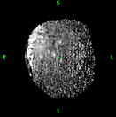
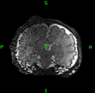
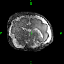
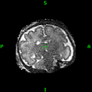
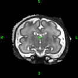
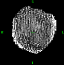
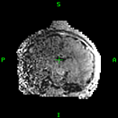
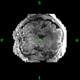
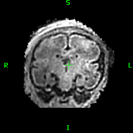
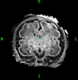

## SVR Grading examples: 

### dHCP T2 cases

| 0 – terrible | 1 – poor | 2 – severe SNR loss | 3 – slight SNR loss | 4 – good |
|:-------------|:---------|:--------------------|:--------------------|:---------|
|  |  |  |  |  |

---

### dHCP T1 cases

| 0 – terrible | 1 – poor | 2 – severe SNR loss | 3 – slight SNR loss | 4 – good |
|:-------------|:---------|:--------------------|:--------------------|:---------|
|  |  |  |  |  |

